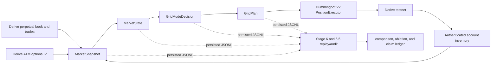
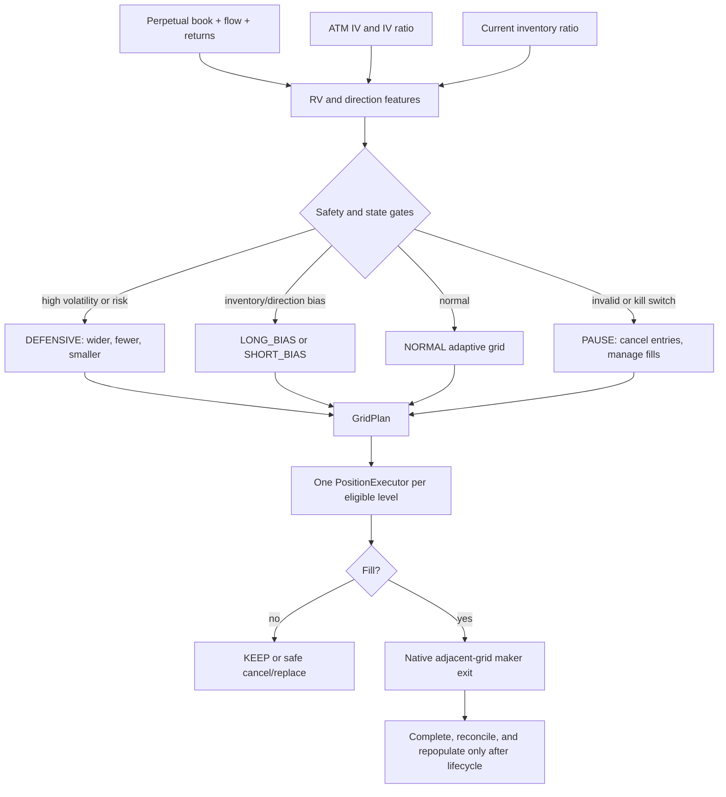

# Derive Adaptive State Grid

An options-aware adaptive grid for Derive perpetuals, implemented as an evidence-first
research and execution prototype for Hummingbot V2.

> **Hackathon status:** Stage 1--8 are implemented as a testnet-only research and
> dry-run boundary. Stage 5 proved a constrained,
> one-level-per-side Derive testnet maker lifecycle up to safe cancellation and
> replacement. Stage 6.5 provides a deterministic replay and audit. A natural live
> maker fill was not observed, so this repository makes no live profitability, fill,
> take-profit, or inventory-feedback claim.

Stage 8 adds a four-asset dry-run coordinator for `BTC-USDC`, `ETH-USDC`,
`SOL-USDC`, and `HYPE-USDC`. BTC ATM IV is a single shared global risk input;
realized volatility, direction, inventory, rolling BTC relationships, modes, and
theoretical plans remain asset-local. A portfolio governor evaluates gross, net,
beta-equivalent, pending, and per-asset exposure before any future execution
adapter. Execution remains disabled and mainnet remains rejected. See
[the Stage 8 runbook](docs/STAGE8_MULTI_ASSET.md) and the generated
[Stage 8 dry-run report](reports/stage8_multi_asset.md).

The Hummingbot portfolio execution adapter accepts configurable `BASE-USDC`
pairs. See [Derive asset switching](docs/DERIVE_ASSET_SWITCHING.md) for the
safe stop, reconfigure, and restart workflow used to change the live testnet
asset without inheriting stale orders or unverified pair limits.

Stage 9 adds a local Streamlit control panel for the existing Condor state: it
stages and validates configuration, shows risk/order-size consequences, previews
Stage 4 grid changes, estimates historical KEEP/REFRESH/NEW/REMOVED behavior,
records redacted history, and detects source-file drift. It has no exchange client
and cannot place or cancel orders. The current Condor monitor builds its Stage 8
configuration at process start, so applied dashboard changes are explicitly marked
`RESTART_REQUIRED`; the Environment page can stage either network, but generated
controller artifacts remain execution-disabled and mainnet trading remains rejected.
See the
[Stage 9 dashboard guide](docs/dashboard.md) and [Stage 9 report](reports/stage9_condor_dashboard.md).

Stage 12 adds the mainnet-shadow baseline gate. It measures the unchanged
strategy against public Derive mainnet data with isolated conservative and
touch-optimistic paper ledgers, verified accounting, timestamped exposure,
order lifecycle/churn, future-data markouts, cycle recycling, deterministic
health classification, and a live `SHADOW TRADING` dashboard. It never creates
a private client or sends exchange mutations. The profile is disabled by
default; Stage 12C observability and the real Stage 12D 60-minute smoke must
remain complete before longer collection. See
[the Stage 12 runbook](docs/STAGE12_MAINNET_SHADOW_BASELINE.md) and the
[Stage 12D smoke report](reports/stage12d_mainnet_shadow_smoke.md).

Stage 14 extends that boundary into a bounded, evidence-based economic shadow
validation. It collects real Derive mainnet public data for up to six hours,
keeps conservative trade-through fills separate from touch-optimistic
sensitivity, freezes the validated Stage 13 configuration, and never enables a
private trading client or exchange mutation. Start it explicitly with:

```bash
PYTHONPATH=src:. .venv/bin/python -m condor.stage14 \
  --profile configs/shadow_competition_800_stage13.yml \
  --duration 6h --interval 5 --trade-transport websocket
```

The run writes its session evidence under `reports/stage14/<session_id>/` and
publishes the live summary to `reports/stage14/latest_summary.json`; the local
dashboard exposes the same evidence under `SHADOW TRADING` on port 8502.

## The one-minute explanation

The strategy combines four inputs:

- Derive perpetual market data: book, spread, microprice, flow, and recent returns.
- Derive ATM options implied volatility (IV), treated as a forward-looking volatility
  and risk-geometry input rather than a directional alpha signal.
- Realized volatility (RV), direction, and inventory state.
- A safety governor that turns those inputs into a mode and a versioned grid plan.

The plan controls grid width, center shift, number of levels, side allocation, and
quote size. Hummingbot V2 `PositionExecutor` instances own the actual order lifecycle,
including the native adjacent-grid take-profit path after a fill.

The contribution is the feedback loop:

```text
perpetual + ATM IV + account state
              -> MarketSnapshot
              -> MarketState
              -> GridModeDecision
              -> GridPlan
              -> Hummingbot V2 executor
              -> Derive testnet
              -> updated account state
```

The current package is a research system with a bounded testnet proof, not a claim
that the strategy is ready for mainnet or profitable in production.

## Architecture



The four state layers remain intentionally separate:

| Layer | Role | Persisted artifact |
| --- | --- | --- |
| `MarketSnapshot` | Point-in-time perpetual, options, and account inputs | `derive_market_snapshots.jsonl` |
| `MarketState` | RV/IV, direction, and inventory classification | `derive_market_states.jsonl` |
| `GridModeDecision` | Normal, defensive, bias, or pause regime | `derive_grid_modes.jsonl` |
| `GridPlan` | Center, width, levels, allocation, and sizing | `derive_grid_plans.jsonl` |

### Compact strategy diagram



## What changes when IV changes?

IV enters the volatility score and therefore can change the candidate mode and plan
geometry. It is not used as a promise that price will move in a particular direction.
In the latest Stage 6.5 counterfactual audit (4,017 canonical frames):

- IV changed the candidate mode in **175 frames**.
- IV changed grid width by more than 5% in **1,306 frames**.
- IV changed candidate level count in **175 frames**.
- IV changed the volatility state in **149 frames**.
- Mean absolute RV contribution was **0.7617** versus **0.2497** for IV; RV explained
  almost all combined-score variance in this sample. That makes IV a meaningful
  structural risk input without making it a standalone alpha claim.

The mode profiles are deliberately interpretable:

| Mode | Geometry | Levels | Allocation / size | Intent |
| --- | --- | ---: | --- | --- |
| `NORMAL` | Standard adaptive width | 5 / side | Balanced, standard size | Quote the current state |
| `DEFENSIVE` | Wider profile | 3 / side | Balanced, 0.5x size | Reduce participation in riskier states |
| `LONG_BIAS` | Standard width | 5 / side | Buy-weighted | Reduce short-side pressure |
| `SHORT_BIAS` | Standard width | 5 / side | Sell-weighted | Reduce long-side pressure |
| `PAUSE` | No new grid | 0 / side | No new entries | Cancel unfilled entries and keep filled executors managed |

Direction is a quote-allocation and center-shift input. It is derived from available
book imbalance, order-flow imbalance, and normalized short returns; it is not a
forecasting model. Inventory is a risk governor: it can shift the center, bias side
allocations, reduce size, and eventually pause new entries.

## Live testnet proof versus offline replay

These evidence classes are intentionally separate.

### LIVE TESTNET / RECORDED

Stage 5F used authenticated Hummingbot API access and the Derive testnet connector
with `BTC-PERP` mapped to Hummingbot's `BTC-USDC` trading pair. The constrained live
rollout kept `allow_mainnet_trading=false`, leverage 1, `post_only=true`, and one
level per side. The two accepted maker orders were:

| Side | Amount | Price | Exchange order ID | Result |
| --- | ---: | ---: | --- | --- |
| Buy `buy_0` | 0.0120 BTC | 77,480.0 | `0e34c975-f179-46dc-85dd-e64fbfa4d2a4` | Accepted, passive, later cancelled |
| Sell `sell_0` | 0.0119 BTC | 77,540.0 | `86d2bc5f-174f-4f8e-8896-f9704be6ca4b` | Accepted, passive, later cancelled |

The live proof covers authenticated submission, real exchange IDs, LIMIT_MAKER / post-
only semantics, passive non-crossing placement, one-level caps, `KEEP` behavior,
duplicate prevention, safe cancel/replace, `DEFENSIVE`, `PAUSE` and recovery, and
graceful cleanup. The account was clean after cleanup: no open orders and no orphan
test orders.

No natural maker fill occurred during the authorized observation window: the public
testnet feed supplied no BTC-PERP executions, and no second account or counterparty
was authorized. Therefore the following are **not live-proven**: a Derive fill,
live position delta, live inventory feedback, a live PositionExecutor take-profit,
realized PnL, or live profitability.

See [the sanitized live evidence matrix](docs/LIVE_EVIDENCE.md) and the detailed
[Stage 5 execution report](reports/stage5_execution.md).

### OFFLINE REPLAY / DETERMINISTIC SIMULATION

Stage 6.5 replayed the canonical Stage 1--4 stream under the
`conservative_cross_through` BBO fill model. It is useful for checking state
transitions, position accounting, fee sensitivity, inventory limits, markouts, and
the static/RV/IV comparison. It is not an exchange execution log.

The separate deterministic Hummingbot simulation also injected an `OrderFilledEvent`
into a real `PositionExecutor` configuration. It verified that a filled buy creates a
native adjacent-grid maker sell exit, that the executor becomes filled/trading, and
that the exit can complete. Those are simulated lifecycle checks, not live Derive
fills.

## Evaluation snapshot

Latest machine outputs: [Stage 6.5 audit summary](reports/stage6_5/audit_summary.json),
common window `2026-08-24T04:00:11.875Z` to `2026-08-24T09:34:57.372Z`, 4,017 canonical
frames. PnL is in USDC-equivalent replay units; inventory is BTC. The three rows use
the same conservative replay assumptions and are not a production ranking.

| Strategy | Entry fills | Cycles | Net realized | Unrealized end | Total PnL | Max drawdown | Max abs inventory |
| --- | ---: | ---: | ---: | ---: | ---: | ---: | ---: |
| Static geometric | 13 | 12 | 5.53705 | -3.47480 | **2.06225** | 12.01867 | 0.0361 |
| RV-only adaptive | 18 | 14 | 6.09257 | -31.37378 | -25.28121 | 41.40466 | 0.0436 |
| IV-aware adaptive | 21 | 17 | 7.83999 | -31.32626 | -23.48627 | 40.77134 | 0.0436 |

The honest conclusion is that IV-aware adaptation changed geometry and modestly
improved the RV-only replay on this short sample, while the static baseline had the
best total PnL and lowest drawdown. This is evidence about behavior and accounting,
not evidence of deployable alpha.

### IV ablation: RV-only versus IV-aware

| Metric | RV-only | IV-aware | IV minus RV |
| --- | ---: | ---: | ---: |
| Mean volatility score | 1.01560 | 1.01144 | -0.00417 |
| Mean grid width | 1.15950% | 1.13485% | -0.02465 pp |
| Defensive time | 14.1897% | 14.1150% | -0.0747 pp |
| Entry fills | 18 | 21 | +3 |
| Completed cycles | 14 | 17 | +3 |
| Net realized PnL | 6.09257 | 7.83999 | +1.74742 |
| Unrealized PnL at end | -31.37378 | -31.32626 | +0.04752 |
| Total PnL | -25.28121 | -23.48627 | +1.79494 |
| Maximum drawdown | 41.40466 | 40.77134 | -0.63332 |
| Maximum absolute inventory | 0.0436 | 0.0436 | 0 |
| 30-second markout | -2.3451 bps | -1.1997 bps | +1.1455 bps |
| Cancel/create ratio | 0.97546 | 0.96970 | -0.00576 |

Source: [`reports/stage6_5/iv_ablation.csv`](reports/stage6_5/iv_ablation.csv). The
audit also passed its no-lookahead and position-accounting checks, while warning that
the sample is short, the source contains conflicting plan timestamps, and raw trades
are missing.

### KEEP-rate and inventory stories

The recorded Stage 6 plan-behavior snapshot reported **90.46% KEEP**, **8.12%
refresh**, and **0.72% new** actions. This is a controller stability measure, not a
fill rate or PnL measure. The Stage 6.5 canonical replay separately recorded 8,046
KEEP events for the IV-aware conservative run, with a 0.0436 BTC maximum absolute
inventory. These figures should not be mixed: the first is recorded controller
behavior, the second is replay accounting.

### Hackathon metrics card

| Evidence label | Headline metric | Value | What it means |
| --- | --- | ---: | --- |
| **LIVE TESTNET** | Accepted passive entry orders | 2 | One buy and one sell; real Derive IDs; both later cleaned up |
| **LIVE TESTNET** | Live depth | 1 level / side | Guardrail remained active; no mainnet or depth increase |
| **RECORDED** | Plan KEEP rate | 90.46% | Existing eligible plans were usually retained; not a fill rate |
| **RECORDED** | Plan refresh / new | 8.12% / 0.72% | Controller behavior snapshot from the Stage 6 report |
| **OFFLINE REPLAY** | Canonical frames | 4,017 | Same-window static/RV/IV audit input |
| **OFFLINE REPLAY** | IV-aware total PnL | -23.48627 | Conservative replay output; not live PnL |
| **OFFLINE REPLAY** | Maximum absolute inventory | 0.0436 BTC | IV-aware replay stress result; not a live position |

## Charts and artifacts

The current report artifacts are directly usable in a submission or demo:

- [IV, RV, and grid-width contribution](reports/stage6_5/charts/01_rv_vs_iv_contribution.svg)
- [Full score versus RV-only score](reports/stage6_5/charts/02_full_vs_rv_volatility_score.svg)
- [IV-minus-RV width delta](reports/stage6_5/charts/03_iv_minus_rv_grid_width.svg)
- [Cumulative PnL by strategy](reports/stage6_5/charts/04_cumulative_pnl_by_strategy.svg)
- [Ending inventory by strategy](reports/stage6_5/charts/06_ending_inventory_by_strategy.svg)
- [Mode frequency](reports/stage6/charts/06_mode_frequency.svg)

The raw source and derived streams are JSONL by design. Stage 6.5 keeps both the raw
and canonical counts: 8,098 raw plan rows, 4,017 canonical frames, and 3,252
conflicting timestamp groups. The audit does not silently pretend the conflict stream
is clean; it deduplicates it, records the choice, and carries the limitation forward.

## Quickstart

This is the safe, read-only path. It does not contact Derive and does not place orders.

```bash
cd /Users/wilfred/Documents/Hummingbot/Derive-Options-Aware-Adaptive-Market-Maker-phase2-market-snapshot
python3.11 -m venv .venv
source .venv/bin/activate
python -m pip install -e '.[dev]'

# Point at the Condor JSONL data directory produced by Stages 1--4.
export CONDOR_DATA_DIR=/Users/wilfred/Documents/Hummingbot/condor/data

# Safe presentation check: reads local files only.
./scripts/demo.sh

# Optional local Stage 9 control panel; reads Condor JSONL and writes only local
# configuration/history files. It does not contact Derive.
python -m pip install -e '.[dashboard]'
./scripts/run_dashboard.sh

# Reproducibility checks.
pytest -q
ruff check .
git diff --check
```

For the full commands, expected inputs, report locations, and the optional isolated
Stage 5 dry-run boundary, read [docs/REPRODUCE.md](docs/REPRODUCE.md). For a judge,
start with [docs/JUDGE_WALKTHROUGH.md](docs/JUDGE_WALKTHROUGH.md). For a two-minute
explanation, use [docs/PITCH.md](docs/PITCH.md).

### Derive/Hummingbot environment notes

The live connector runs in the installed Hummingbot/Docker environment, not in the
host research virtualenv. Configure testnet credentials only in the local Hummingbot
API or protected environment; never commit them. The controller expects the
Hummingbot mapping `BTC-PERP` -> `BTC-USDC` and uses HTTP Basic Auth in-process.

Two narrow compatibility shims are kept beside the Stage 5 controller:

- `orderbook_snapshot_compat.py` handles a connector startup race where the listener
  can receive the initial snapshot before the request consumer.
- `derive_perpetual_signing_compat.py` handles the pinned testnet connector's legacy
  signing and post-only wire compatibility.

These are environment/version adapters. They do not change the State -> Mode -> Plan
strategy logic. The example controller config is fail-closed:
`execution_enabled=false`, `allow_mainnet_trading=false`, `post_only=true`, and
`execution_max_levels_per_side=1`.

### Stage 10 bounded self-tuning observer

Stage 10 currently implements Phase 1 only: a deterministic observer over the
existing Condor JSONL streams. It runs in `SUGGEST_ONLY`, preserves unsupported
live metrics as `UNKNOWN`, labels offline replay as `SHADOW_REPLAY`, and never
mutates configuration or calls an exchange. Open the `SELF-TUNING` page at
`http://localhost:8501` or run the artifact command directly:

```bash
.venv/bin/python tools/run_stage10_observer.py \
  --data-dir /Users/wilfred/Documents/Hummingbot/condor/data
```

See [reports/stage10_self_tuning.md](reports/stage10_self_tuning.md) for the
phase boundary, evidence status, and deferred diagnosis/promotion work.

### Stage 11 Phase A measurement

Stage 11 currently stops at measurement. `VolumeEfficiencyMetrics` reuses the
existing observer's event/state contract to count actual fills, time-weighted
risk/inventory, cycles, quote lifetime, markout, capture, fees, and drawdown.
It does not optimize or mutate execution. Generate local artifacts with:

```bash
.venv/bin/python tools/run_stage11_measurement.py \
  --data-dir /Users/wilfred/Documents/Hummingbot/condor/data
```

See [reports/stage11_volume_efficiency.md](reports/stage11_volume_efficiency.md)
for the evidence stop and `UNKNOWN` handling.

## Project structure

```text
src/derive_options_mm/                 Stage 1--4 state and grid engine
evaluation/                             Stage 6 replay and Stage 6.5 audit
evaluation/self_tuning_observer.py      Stage 10 Phase 1 performance observer
tools/run_stage11_measurement.py        Stage 11 Phase A measurement command
integrations/condor/                    Condor routines and read-only data bridge
integrations/hummingbot/                Stage 5 V2 controller and compatibility shims
tests/                                  unit, integration, and lifecycle tests
tools/                                  deterministic lifecycle and demo helpers
scripts/demo.sh                         safe judge/demo entry point
reports/stage5_execution.md             live testnet evidence and boundary
reports/stage6/                         comparison charts and replay outputs
reports/stage6_5/                       canonical audit and ablation outputs
reports/stage10/                        Stage 10 observer supportability outputs
reports/stage11/                        Stage 11 Phase A measurement outputs
docs/                                   judge, demo, pitch, FAQ, and submission docs
```

## Reproducibility and claim ledger

### Validated claims

- **LIVE TESTNET:** authenticated, passive, post-only one-level order submission;
  real Derive IDs; KEEP and duplicate prevention; cancel/replace; DEFENSIVE; PAUSE;
  recovery; cleanup.
- **RECORDED:** Stage 1--4 snapshot/state/mode/plan streams, mode transitions, grid
  geometry, IV coverage/staleness checks, and the controller KEEP-rate snapshot.
- **OFFLINE REPLAY:** static/RV/IV comparison, BBO fill-model accounting, fees,
  markouts, inventory stress, and counterfactual IV impact.
- **DETERMINISTIC Hummingbot SIMULATION:** fill-dependent PositionExecutor state,
  adjacent-grid take-profit direction, exit completion, and post-completion
  repopulation behavior.

### Explicitly not validated

- Live Derive maker fills, live take-profit fills, live realized PnL, live inventory
  feedback, queue position, profitability, or production execution quality.
- Mainnet trading or live mainnet execution. The dashboard supports only a
  fail-closed read-only mainnet configuration for connectivity review.
- Out-of-sample performance, statistical significance, or robustness across market
  regimes.
- ML/LLM decision loops or a claim that options IV forecasts direction.

## Limitations and next steps

The next safe research step is a separately authorized, controlled testnet fill
experiment with a counterparty or a documented exchange-side test mechanism. It must
preserve the one-level cap, testnet-only guard, post-only behavior, and full audit
trail. Only after a fill-dependent lifecycle is evidenced should the project consider
more levels or broader replay design. Mainnet trading remains out of scope for this
package.

## Submission checklist

- [x] Honest options-aware strategy pitch with no profitability claim.
- [x] Architecture and compact strategy diagrams.
- [x] Live testnet evidence separated from deterministic replay evidence.
- [x] Static/RV/IV evaluation and IV ablation from latest Stage 6.5 files.
- [x] Rate, inventory, limitations, and claim-status stories.
- [x] Safe read-only demo and judge walkthrough.
- [x] Reproduction commands and project structure.
- [x] `allow_mainnet_trading=false`; no increase beyond one live level per side.
- [ ] Natural live maker fill and live fill-dependent feedback loop (not observed).

The recommended final reading order is [the demo guide](docs/DEMO.md), [the live
evidence](docs/LIVE_EVIDENCE.md), [the evaluation audit](reports/stage6_5_validation.md),
and [the submission package](docs/SUBMISSION.md).
